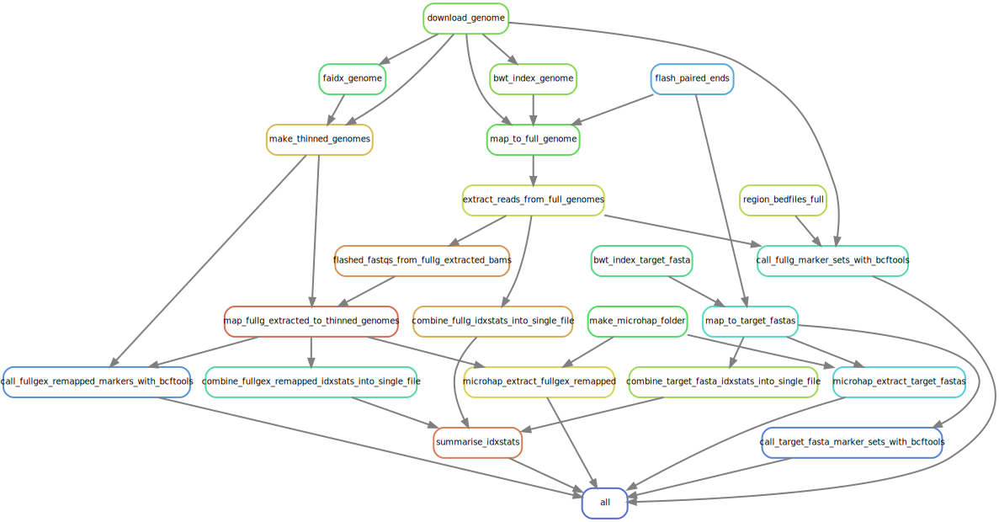

mega-simple-microhap-snakeflow
================

- <a href="#quick-start" id="toc-quick-start">Quick Start</a>
- <a href="#single-end-data" id="toc-single-end-data">Single-end data</a>
- <a href="#rulegraph" id="toc-rulegraph">Rulegraph</a>
- <a href="#inputs" id="toc-inputs">Inputs</a>
  - <a href="#samplesheetcsv"
    id="toc-samplesheetcsv"><code>SampleSheet.csv</code></a>
  - <a href="#samplescsv-and-unitscsv"
    id="toc-samplescsv-and-unitscsv">samples.csv and units.csv</a>
- <a href="#production-runs" id="toc-production-runs">Production runs</a>
- <a href="#multi-run-variant-calling"
  id="toc-multi-run-variant-calling">Multi-run variant calling</a>
  - <a href="#making-a-vcf-for-microhaplot-after-multi-run-variant-calling"
    id="toc-making-a-vcf-for-microhaplot-after-multi-run-variant-calling">Making
    a VCF for microhaplot after multi-run variant calling</a>
  - <a href="#a-word-on-getting-those-files-off-a-remote-server"
    id="toc-a-word-on-getting-those-files-off-a-remote-server">A word on
    getting those files off a remote server</a>

This repository holds the Snakemake-based workflow for implementing the
**M**olecular **E**cology and **G**enetic **A**nalysis Team’s **Simple**
**Microhaplotyping** workflow. Hence the name,
*mega-simple-microhap-snakeflow*. It was written and is maintained by
Eric C. Anderson at NOAA’s Southwest Fisheries Science Center with input
and assistance from Anthony Clemento and Ellen Campbell. This is a
workflow to provide genotypes of individual fish (or other organisms) at
microhaplotypes associated with different sets of amplicons. It is
configurable to be able to work with different species, different marker
sets, and different ways in which the marker-set reference sequences are
specified.

The development and Snakemake code within this workflow isn’t entirely
“mega-simple.” There are a couple of features of the code/wildcarding
that could be streamlined, and might be at some point. Nonetheless, once
all the configurations are in place for a given species and all of the
different panels of amplicons associated with it, it is pretty simple to
run it.

## Quick Start

If you just want to get the workflow and run the included, small, test
data set on your own laptop or cluster, here are the steps:

1.  Get this repository with something like
    `git clone https://github.com/eriqande/mega-simple-microhap-snakeflow.git`

2.  Make sure that you have R installed and that you have successfully
    installed the packages `tidyverse` and `remotes`. (We have not found
    a way to use a conda-maintained R installation that works for our
    purposes here).

3.  Make sure you have Miniconda installed.

4.  Get a full install of a Snakemake conda environment by following the
    directions
    [here](https://snakemake.readthedocs.io/en/stable/getting_started/installation.html).

5.  Activate that snakemake conda environment

6.  From within the `mega-simple-microhap-snakeflow` directory give this
    command:

    ``` sh
    snakemake --config run_dir=.test/data --configfile config/Chinook/config.yaml  --use-conda -np
    ```

    It should spit out a bunch of stuff that ends with something like
    this:

    ``` sh
    Job counts:
        count   jobs
        1   all
        2   call_fullg_marker_sets_with_bcftools
        2   call_fullgex_remapped_markers_with_bcftools
        2   call_target_fasta_marker_sets_with_bcftools
        20  extract_reads_from_full_genomes
        33  flash_paired_ends
        20  flashed_fastqs_from_fullg_extracted_bams
        1   make_microhap_folder
        20  map_fullg_extracted_to_thinned_genomes
        20  map_to_full_genome
        26  map_to_target_fastas
        2   microhap_extract_fullgex_remapped
        2   microhap_extract_target_fastas
        151
    This was a dry-run (flag -n). The order of jobs does not reflect the order of execution.
    ```

7.  If that worked, you can do a full run with this:

    ``` sh
    snakemake --config run_dir=.test/data --configfile config/Chinook/config.yaml  --use-conda --cores 1
    ```

    The test data set is small enough that a single core is enough.
    However, the first time you run it, you can expect to spend quite a
    bit of time (30 minute to a couple hours, depending on the speed of
    your computer) downloading the Otsh_v1.0 genome and indexing it with
    bwa.

## Single-end data

This workflow was originally developed for paired end data. If you have
single end data, you can just set the `fq1` and `fq2` values in each row
in `samples.csv` to be the path to the single end file. **Note: you must
use `use_trimmomatic: false` in the config if you are using single-end
data (for now).**

## Rulegraph

No snakemake workflow description is complete without a quick DAG
showing all the different rules. Here it is for the test data set
obtained with:

``` sh
snakemake --config run_dir=.test/data \
          --configfile config/Chinook/config.yaml  \
          --rulegraph | \
   dot -Tsvg > rulegraph.svg
```



## Inputs

Assuming that you are running some sequencing data for a species that is
already configured (meaning that the reference genomes and target
regions are specified), then all you need to worry about is the
sequencing and meta data input that you must provide. (This will be the
case if you are using amplicons and specifications developed at the
SWFSC).

The basic idea of the workflow is that input data (both sequences and
meta data) from any single MiSeq run (or, presumably a run on a
different sequencing platform) are provided in a single directory with
fairly strict formatting guidelines. The workflow then proceeds upon
those data, and, in the process, populates that input directory with a
number of additional directories containing outputs and some
intermediate files.

For example, the directory `.test/data` in the repository is this sort
of input directory. It is obviously a pared-down version of a typical
sequencing run which might include hundreds of individuals, but it
serves out illustrative purposes here, nonetheless.

In order for the snakemake-based workflow to run upon such a directory,
it must have the following elements

1.  A directory `raw` that includes only the paired-end FASTQ files from
    the sequencing.
2.  A file `samples.csv` (described below) that includes one line for
    each sample giving information about the path to the FASTQ file that
    originated from each sample, additional identifiers for the sample,
    and also the names of the amplicon panels at which the the sample
    was amplified.
3.  A file `units.csv` (also described below) that has a single line for
    each combination of a sample and an amplicon panel / marker set.

It is also good practice to have an additional file called `meta.csv`
that includes additional meta data for each sample in `samples.csv`;
however this is not a requirement.

In our workflow at the SWFSC the `samples.csv` and `units.csv` file are
generated from the the sample sheet associated with the sequencing run
using the included R script in
`preprocess/sample-sheet-processing-functions.R`. This is the
recommended way to obtain `samples.csv` and `units.csv`, and is the only
way that we will document that here. Therefore, in practice, each user
should plan to start with input data from the sequencer that includes:

1.  The directory `raw` that includes only the paired-end FASTQ files
    from the sequencing.
2.  A file named `SampleSheet.csv` that includes information about the
    samples that were included on the sequencing run.

The key to making sure all of this will run smoothly is to be strict
about the formatting and contents of `SampleSheet.csv` which are
described in the next section.

### `SampleSheet.csv`

The example `SampleSheet.csv` that comes with the small test data set
with the repository can be most easily viewed on GitHub
[here](https://github.com/eriqande/mega-simple-microhap-snakeflow/blob/main/.test/data/SampleSheet.csv).

As you can see, there are a bunch of header/preamble lines in it that
are part of the standard MiSeq output. The functions in
`preprocess/sample-sheet-processing-functions.R` find the start of the
data section by finding the line that starts with `[Data]`. So, if your
file doesn’t have that, it won’t work!

As currently configured, the scripts in
`preprocess/sample-sheet-processing-functions.R` are setup for our own
conventions and things. Just go ahead and look at the functions to
understand what is going on there. For our purposes at the SWFSC, we
have these conventions:

- Our NMFS_DNA_ID is the part before the first underscore in the
  `Sample_Plate` column. If your protocol has the sample ID in the
  Sample_ID column, then that is accommodated as described below.

- The marker sets to process each individual (row) at is given as a
  comma-separated (white space around the commas is stripped) series of
  marker-set names in the `Description` column.

- The `Sample_Name` column *must* give the identifier of the individual
  that forms the beginning of the name of its fastq files in raw. In
  particular, if YYYYYYY is the entry for the individual in the
  `Sample_Name` column, then its paired-end fastq files stored in the
  `raw` directory *must* match the regular expressions:

  ``` sh
  YYYYYYY_.*_L00[0-9]_R1_00[0-9].fastq.gz

  and 

  YYYYYYY_.*_L00[0-9]_R2_00[0-9].fastq.gz
  ```

  Entries in the `Sample_Name` *must not* have any underscores in them.
  The letters before the first underscore in the fastq file name is used
  to match each entry in the `Sample_Name` column to its fastq files.

### samples.csv and units.csv

In our workflows, these are produced from the SampleSheet.csv file using
the `create_samples_and_units()` function defined in
`preprocess/sample-sheet-processing-functions.R` like this, in R with
the working directory set to the top level of the workflow repository:

``` r
source("preprocess/sample-sheet-processing-functions.R")
create_samples_and_units(".test/data/SampleSheet.csv")
```

It is pretty straighforward. If you are trying to process a
`SampleSheet.csv` that lives in a directory `mypath/mydir` then you
simply do:

``` r
source("preprocess/sample-sheet-processing-functions.R")
create_samples_and_units("mypath/mydir/SampleSheet.csv")
```

and that will create `samples.csv` and `units.csv` in the directory
`mypath/mydir` alongside `SampleSheet.csv`.

If you have your sample ID in the Sample_ID column, then you can do like
this:

``` r
source("preprocess/sample-sheet-processing-functions.R")
create_samples_and_units(
    "mypath/mydir/SampleSheet.csv",
    NMFS_DNA_ID_from_Sample_ID = TRUE
)
```

If you are going to make `samples.csv` and `units.csv` yourself here are
some examples so you can see their structure and what you need to put in
them:
[samples.csv](https://github.com/eriqande/mega-simple-microhap-snakeflow/blob/main/.test/data/samples.csv)
and
[units.csv](https://github.com/eriqande/mega-simple-microhap-snakeflow/blob/main/.test/data/units.csv).

## Production runs

Here is an idea of how a production-run command line might look for five
directories. After checking out a node with 20 cores…

``` sh
for i in data/200715_M02749_0092_000000000-CV34F \
    data/201012_M02749_0095_000000000-CWHDK \
    data/210129_M02749_0102_000000000-J33JD \
    data/200828_M02749_0093_000000000-CV2FP \
    data/201019_M02749_0096_000000000-CV34D; do
    snakemake --config run_dir=$i --configfile config/Chinook/config.yaml --use-conda --use-envmodules --cores 20
done
    
```

## Multi-run variant calling

This is our current setup to simply call variants after running multiple
directories. It just using globbing to figure out which BAMs were
produced. It does not parse the sample sheets of each run to figure out
which individuals should have BAMs and request those.

This is only imlemented for the fullgex-remapped-to-thinned stuff, at
the moment, but I will get it going for the target_fastas soon, too.

Here is how to do it:

1.  Establish a directory in the top level called
    `MULTI_RUN_RESULTS/some_directory_name` where `some_directory_name`
    is some informative name.

2.  Inside that directory make a file called `dirs.txt` which lists the
    run paths to the directories you want to include individuals from
    (if any for the marker sets you will request). The paths should be
    relative to the top-level of the `mega-simple-microhap-snakeflow`
    directory. For example, after the above to steps you might have:

    ``` sh
    # A directory
    MULTI_RUN_RESULTS/5_early_runs

    # a file dirs.txt within that with the following contents shown
    (snakemake) [node11: mega-simple-microhap-snakeflow]--% cat MULTI_RUN_RESULTS/5_early_runs/dirs.txt
    data/200715_M02749_0092_000000000-CV34F
    data/200828_M02749_0093_000000000-CV2FP
    data/201012_M02749_0095_000000000-CWHDK
    data/201019_M02749_0096_000000000-CV34D
    data/210129_M02749_0102_000000000-J33JD

    # that is just 5 lines, each with a path to a previously run run directory!
    ```

3.  Request the output file you want by replacing the wildcards, as
    appropriate, in the following output path:

    ``` sh
    MULTI_RUN_RESULTS/{multi_run_dir}/{species_dir}/vcfs/{marker_set}/fullgex_remapped/{genome}/variants-from-multi-runs-bcftools.vcf
    ```

    In our example, if we wanted to do this for both WRAP and LFAR, the
    output targets we would request would be:

    ``` sh
    MULTI_RUN_RESULTS/5_early_runs/Chinook/vcfs/{LFAR,WRAP}/fullgex_remapped/Otsh_v1.0/variants-from-multi-runs-bcftools.vcf
    ```

    Note the use of the Unix brace expansion to get two paths out of
    that—one for LFAR and one for WRAP.

4.  Request that target with snakemake. The full command would look
    like:

    ``` sh
    snakemake --use-conda --cores 20  \
    MULTI_RUN_RESULTS/5_early_runs/Chinook/vcfs/{LFAR,WRAP}/fullgex_remapped/Otsh_v1.0/variants-from-multi-runs-bcftools.vcf
    ```

### Making a VCF for microhaplot after multi-run variant calling

The obvious reason for doing multi-run variant calling is to have
sufficient numbers of individuals from enough populations to ensure that
you have most of the interesting variants for forming microhaplotypes.
Here is how you create a new VCF for microhaplot, after doing the above
multi-run variant calling. Here I show some simple steps for the WRAP
markers:

First, filter out sites with a lot of missing data:

``` sh
WRAP=MULTI_RUN_RESULTS/5_early_runs/Chinook/vcfs/WRAP/fullgex_remapped/Otsh_v1.0/variants-from-multi-runs-bcftools.vcf
(snakemake) [node11: mega-simple-microhap-snakeflow]--% bcftools view -i 'F_MISSING < 0.30' $WRAP | awk '!/^#/' | wc
     55   37455  867160
(snakemake) [node11: mega-simple-microhap-snakeflow]--% bcftools view -i 'F_MISSING < 0.10' $WRAP | awk '!/^#/' | wc
     53   36093  824120
(snakemake) [node11: mega-simple-microhap-snakeflow]--% bcftools view -i 'F_MISSING < 0.03' $WRAP | awk '!/^#/' | wc
     53   36093  824120
# OK! Looks like 53 variants in the 24 regions/microhaps

# How many alternate alleles out of how many total alleles at each site?
(snakemake) [node11: mega-simple-microhap-snakeflow]--% bcftools view -i 'F_MISSING < 0.03' $WRAP | bcftools query -f '%CHROM\t%POS\t%AC/%AN\n'
NC_037104.1:55923357-55923657   151 583/1322
NC_037104.1:55966251-55966551   149 632/1322
NC_037104.1:55966251-55966551   151 641/1322
NC_037104.1:56061938-56062238   151 604/1322
NC_037104.1:56061938-56062238   182 1322/1322
NC_037104.1:56088878-56089178   151 452/1322
NC_037108.1:73538966-73539266   151 524/1318
NC_037108.1:73538966-73539266   160 57/1320
NC_037108.1:73538966-73539266   214 56/1320
NC_037108.1:73540716-73541016   151 526/1322
NC_037108.1:73543706-73544006   130 148/1322
NC_037108.1:73543706-73544006   133 17/1322
NC_037108.1:73543706-73544006   151 475/1322
NC_037108.1:73553140-73553440   151 475/1324
NC_037112.1:24500367-24500667   151 468/1320
NC_037112.1:24542569-24542869   151 455/1324
NC_037112.1:24542569-24542869   165 63/1324
NC_037112.1:24542569-24542869   172 891/1324
NC_037112.1:24593758-24594058   151 454/1320
NC_037112.1:24593758-24594058   181 141/1320
NC_037112.1:24609163-24609463   151 874/1322
NC_037112.1:24609163-24609463   188 447/1320
NC_037112.1:24618993-24619293   109 9/1322
NC_037112.1:24618993-24619293   131 455/1322
NC_037112.1:24618993-24619293   151 867/1322
NC_037112.1:24704405-24704705   151 454/1322
NC_037112.1:24704405-24704705   207 29/1322
NC_037112.1:24721041-24721341   141 450/1320
NC_037112.1:24721041-24721341   162 448/1320
NC_037112.1:24999768-25000068   125 455/1320
NC_037112.1:24999768-25000068   147 456/1320
NC_037112.1:24999768-25000068   155 455/1320
NC_037112.1:25015012-25015312   118 532/1322
NC_037112.1:25015012-25015312   151 453/1322
NC_037112.1:25015012-25015312   161 2/1322
NC_037112.1:25015012-25015312   163 801,6/1322
NC_037112.1:28278997-28279297   125 256/1326
NC_037112.1:28278997-28279297   151 508/1324
NC_037112.1:28296342-28296642   130 11/1324
NC_037112.1:28296342-28296642   149 467/1324
NC_037112.1:28296342-28296642   150 77/1308
NC_037112.1:28296342-28296642   151 482/1324
NC_037112.1:28296342-28296642   165 15/1324
NC_037112.1:28320487-28320787   126 53/1322
NC_037112.1:28320487-28320787   128 39/1322
NC_037112.1:28320487-28320787   137 831/1318
NC_037112.1:28320487-28320787   151 540/1322
NC_037112.1:28350510-28350810   116 22/1322
NC_037112.1:28350510-28350810   141 1170/1322
NC_037112.1:28350510-28350810   151 530/1322
NC_037112.1:28350510-28350810   163 363/1322
NC_037121.1:6243491-6243791 151 474/1324
NC_037121.1:6268440-6268740 151 448/1318

# So, some of them are quite rare, but let's go ahead and keep
# those in there...That is still fewer than two variants per
# amplicon, on average.

# Finally, let's make a VCF file with only one individual in it
# to use for our microhaplot VCF:
(snakemake) [node11: mega-simple-microhap-snakeflow]--% bcftools view -i 'F_MISSING < 0.03' $WRAP | bcftools view -s T170774  > config/Chinook/canonical_variation/WRAP-24-amplicons-53-variants.vcf
```

Now, to add that into the workflow, let’s request another set of
canonical variation in the Chinook config:

``` yaml
WRAP:
    genome:
      Otsh_v1.0:
        regions: config/Chinook/regions/WRAP-Otsh_v1.0.txt
        microhap_variants:
          all_variants: config/Chinook/canonical_variation/WRAP-all-snps-round-1.vcf
          after_5_runs: config/Chinook/canonical_variation/WRAP-24-amplicons-53-variants.vcf  <--- this line added
  
```

After that, invoking Snakemake will see that there are new microhap
variants for things to be run at, if there are any WRAP fish in the run.
Cool!

### A word on getting those files off a remote server

If we just did 5 runs worth of microhaplot for LFAR and WRAP, the
results would be found in directories like this:

``` sh
(snakemake) [node11: mega-simple-microhap-snakeflow]--% pwd
/home/eanderson/Documents/git-repos/mega-simple-microhap-snakeflow
(snakemake) [node11: mega-simple-microhap-snakeflow]--% ls data/*/Chinook/microhaplot/*after_5*
data/200715_M02749_0092_000000000-CV34F/Chinook/microhaplot/LFAR--fullgex_remapped_to_thinned--Otsh_v1.0--after_5_runs_posinfo.rds
data/200715_M02749_0092_000000000-CV34F/Chinook/microhaplot/LFAR--fullgex_remapped_to_thinned--Otsh_v1.0--after_5_runs.rds
data/200828_M02749_0093_000000000-CV2FP/Chinook/microhaplot/LFAR--fullgex_remapped_to_thinned--Otsh_v1.0--after_5_runs_posinfo.rds
data/200828_M02749_0093_000000000-CV2FP/Chinook/microhaplot/LFAR--fullgex_remapped_to_thinned--Otsh_v1.0--after_5_runs.rds
data/200828_M02749_0093_000000000-CV2FP/Chinook/microhaplot/WRAP--fullgex_remapped_to_thinned--Otsh_v1.0--after_5_runs_posinfo.rds
data/200828_M02749_0093_000000000-CV2FP/Chinook/microhaplot/WRAP--fullgex_remapped_to_thinned--Otsh_v1.0--after_5_runs.rds
data/201012_M02749_0095_000000000-CWHDK/Chinook/microhaplot/LFAR--fullgex_remapped_to_thinned--Otsh_v1.0--after_5_runs_posinfo.rds
data/201012_M02749_0095_000000000-CWHDK/Chinook/microhaplot/LFAR--fullgex_remapped_to_thinned--Otsh_v1.0--after_5_runs.rds
data/201019_M02749_0096_000000000-CV34D/Chinook/microhaplot/WRAP--fullgex_remapped_to_thinned--Otsh_v1.0--after_5_runs_posinfo.rds
data/201019_M02749_0096_000000000-CV34D/Chinook/microhaplot/WRAP--fullgex_remapped_to_thinned--Otsh_v1.0--after_5_runs.rds
data/210129_M02749_0102_000000000-J33JD/Chinook/microhaplot/LFAR--fullgex_remapped_to_thinned--Otsh_v1.0--after_5_runs_posinfo.rds
data/210129_M02749_0102_000000000-J33JD/Chinook/microhaplot/LFAR--fullgex_remapped_to_thinned--Otsh_v1.0--after_5_runs.rds
data/210129_M02749_0102_000000000-J33JD/Chinook/microhaplot/WRAP--fullgex_remapped_to_thinned--Otsh_v1.0--after_5_runs_posinfo.rds
data/210129_M02749_0102_000000000-J33JD/Chinook/microhaplot/WRAP--fullgex_remapped_to_thinned--Otsh_v1.0--after_5_runs.rds
```

They all have the same name, so it is the directory structure that
distinguishes them. To get these all to your laptop, rsync with the R
option is your friend (and you can test with the `-n` dry-run option
before doing it):

``` sh
 rsync -avR eanderson@sedna.nwfsc2.noaa.gov:'/home/eanderson/Documents/git-repos/mega-simple-microhap-snakeflow/./data/*/Chinook/microhaplot/*-after_5_*' ./
```

Note the use of the single quotes to avoid expanding the wildcards on
the local machine, and instead send them to the remote machine. And
*also* note the `.` in: `mega-simple-microhap-snakeflow/./data`. That
tells rsync to only include the part of the path to the left of the dot.
Cool! After running the above command, we have:

``` sh
(base) /from_cluster/--% (master)  tree .
.
└── data
    ├── 200715_M02749_0092_000000000-CV34F
    │   └── Chinook
    │       └── microhaplot
    │           ├── LFAR--fullgex_remapped_to_thinned--Otsh_v1.0--after_5_runs.rds
    │           └── LFAR--fullgex_remapped_to_thinned--Otsh_v1.0--after_5_runs_posinfo.rds
    ├── 200828_M02749_0093_000000000-CV2FP
    │   └── Chinook
    │       └── microhaplot
    │           ├── LFAR--fullgex_remapped_to_thinned--Otsh_v1.0--after_5_runs.rds
    │           ├── LFAR--fullgex_remapped_to_thinned--Otsh_v1.0--after_5_runs_posinfo.rds
    │           ├── WRAP--fullgex_remapped_to_thinned--Otsh_v1.0--after_5_runs.rds
    │           └── WRAP--fullgex_remapped_to_thinned--Otsh_v1.0--after_5_runs_posinfo.rds
    ├── 201012_M02749_0095_000000000-CWHDK
    │   └── Chinook
    │       └── microhaplot
    │           ├── LFAR--fullgex_remapped_to_thinned--Otsh_v1.0--after_5_runs.rds
    │           └── LFAR--fullgex_remapped_to_thinned--Otsh_v1.0--after_5_runs_posinfo.rds
    ├── 201019_M02749_0096_000000000-CV34D
    │   └── Chinook
    │       └── microhaplot
    │           ├── WRAP--fullgex_remapped_to_thinned--Otsh_v1.0--after_5_runs.rds
    │           └── WRAP--fullgex_remapped_to_thinned--Otsh_v1.0--after_5_runs_posinfo.rds
    └── 210129_M02749_0102_000000000-J33JD
        └── Chinook
            └── microhaplot
                ├── LFAR--fullgex_remapped_to_thinned--Otsh_v1.0--after_5_runs.rds
                ├── LFAR--fullgex_remapped_to_thinned--Otsh_v1.0--after_5_runs_posinfo.rds
                ├── WRAP--fullgex_remapped_to_thinned--Otsh_v1.0--after_5_runs.rds
                └── WRAP--fullgex_remapped_to_thinned--Otsh_v1.0--after_5_runs_posinfo.rds

16 directories, 14 files
```
