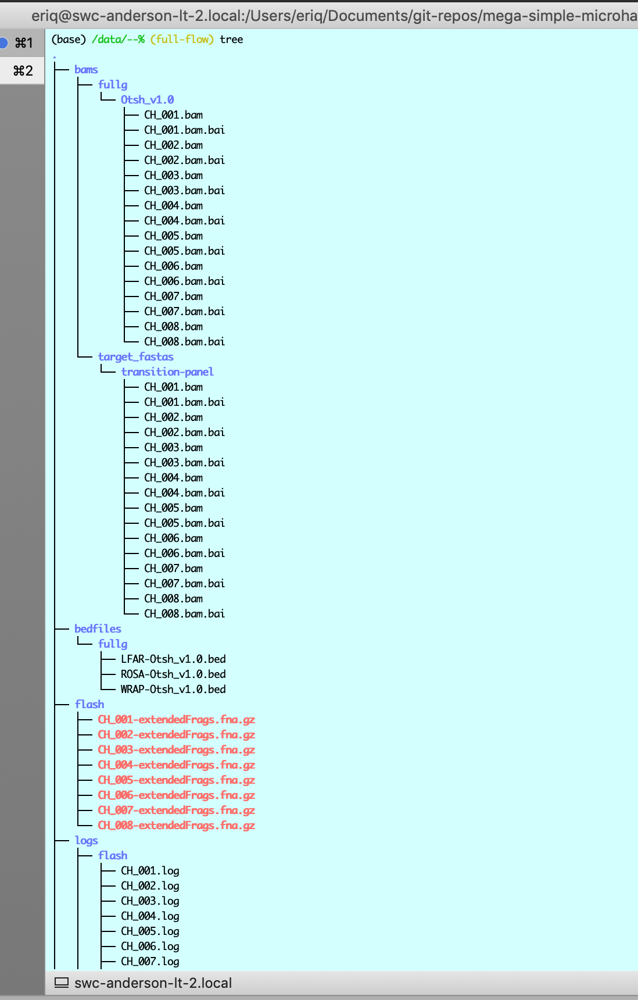

```{r setup, include=FALSE}
knitr::opts_chunk$set(echo = TRUE)
```

These are just some notes and things I jotted down while
developing the workflow.  That might not all be relevant
nor consistent any longer.

# "Post-hoc" Rules

## multi_dir_variant_calling.smk

This is a recently added rule that lets one quickly call variants from
muliple runs together.  The inspiration for this came from the possibility
of a situtation where run A might include individuals from only one population
of a species and run B might include individuals from only a different
population.  If these pops happen to be fixed for different variants, then
those will never show up in the VCFs, unless all them are run together.
So, this rule is there to allow the user to easily call variation from
previously created BAMs.  It _does not_ use any sample sheet information to
figure out which individuals should be included. Rather it just globs the
existing BAM files for each marker set that have already been run. Not only that,
but it currently requires the user to set up the directory for the outputs to be run in,
and also a file that lists the input run directories.  And the user has to request
the output target with the correct file path, etc.


# Development related stuff.  Will be cleaned up later.

OK, after a lot of thinking and experimenting, this is how I
want to do it:

The input data will all come in a single directory with the following
items in it:

- `samples.csv`: the list of samples
- `units.csv`: the units file.
- `raw/`: a directory full of the paired end fastq file.  

In the config file (or more likely on the command line) we specify the
path (relative or absolute) of this directory, calling it the `run_dir`.  

Actually, we might allow that the `run_dir` could be a list, if we wanted it
to be.  In which case the workflow would operate over multiple directories.
Actually, that would be a huge PITA, so I will not do that...

But, I think that I will specify the run_dir as a wildcard in the workflow, because
otherwise I have to repeatedly use the format method on a bunch of paths...

## samples.csv and units.csv

After a lot of learning and then figuring out what we need for our
microhap workflow, this is how we are going to do it:

1. Each run will come off the machine, and it will be associated with
a `samples.csv` file that gives the run-names
(i.e. like CH_117_LFAR_001) of the individual
samples.  These are apparently based on the individually barcoded
units in the run, so each run-name gets broken into its own pair
of fastq files.  There might be multiple species on a run.
2. The first step, which is not part of the snakemake workflow is to
use an R script to break the run into different folders, one for each
species.  Each folder has a `samples.csv` file and a `raw` directory
that houses the fastq files.  This step also creates a `units.csv` file
that includes one line for each "unit" which in this case is the
combination of a run-name _and_ a marker set (which would be based on
the PCR primers, like LFAR, WRAP, ROSA, TRANSITION, etc.)

A little explanation will be helpful here.  In `.test/data/samples.csv`
I have a simple example:
```{r, message=FALSE}
library(tidyverse)

samples <- read_csv(".test/data/samples.csv")

samples
```

From this, the units.tsv file would have been made, something like this:
```r
units <- samples %>%
  mutate(Markers = str_split(Marker_Sets, "\\s*,\\s*")) %>%
  unnest(cols = Markers) %>%
  select(-Marker_Sets) %>%
  select(Sample_ID, Markers, everything())
```
Those have been stored in `.test/data/units.csv` and look like this:
```{r, message=FALSE}
read_csv(".test/data/units.csv")
```

## The config file

This file is in `config/newconfig.yaml`.  So far it looks like this:
```yaml
`r paste(readLines("config/Chinook/config.yaml"), collapse = "\n")`
```

# Notes on Development

## Some python that is good to know

### Flattening lists

Since the `+` operator catenates elements of lists together:
```python
>>> a = [1]; b = [2]; a + b
[1, 2]
```
You can also use sum to flatten lists:
```python
>>> lumpy = [[1, 2, 3], [8, 9, 10], [4], [5]]
>>> lumpy
[[1, 2, 3], [8, 9, 10], [4], [5]]

# the second argument here is the starting list to start catenating to.
# So we pass it an empty list...
>>> sum(lumpy, [])
[1, 2, 3, 8, 9, 10, 4, 5]
```

## Testing python snippets

For someone like me who is not super familiar with python, it
is nice to be able to test various constructions in the python
interpreter.  Here are some fun tricks to allows that to happen.


### Unpacking dictionary keys and values

If you have several genomes, for example, in your config:
```python
[*config["genome].keys()]
```
The `*` "unpacks" the `odict_keys` object into the enclosing list environment.

Note that you might also use `list(config["genome"].keys())`.


### Interpreter access to `config` variable

In order to have access to variables like the
`config` dictionary when doing that, we can read it in
with functions from snakemake's io module like this:
```python
from snakemake.io import load_configfile
config = load_configfile("config/config.yaml")

# then test to see if we have things where we expect them:
config["run"]
config["marker_sets"]["LFAR"]["genome"].keys()
config["marker_sets"]["LFAR"]["genome"]["Otsh_v1.0"]["regions"]

# or this, which returns a list of the regions files for LFAR over
# all the genomes (although there is only one)
[config["marker_sets"]["LFAR"]["genome"][x]["regions"] for x in config["marker_sets"]["LFAR"]["genome"].keys()]

# or get a list of all the marker sets that are genome-focused
config["genome_focused_marker_sets"]["names"]

```

### Interactive python-session testing of input functions

Often we need to write functions that return possible file names and
paths to the `input` field of a rule.  It is nice to be able to
test those just in an interactive python session.  We can do that
by making our own `wildcards` object, and then assigning attributes
to it and passing it to our functions.

That goes like this:
```python

# create a generic object class (called Foo here)
class Foo(object):
    pass

# make a variable, wildcards, which is an object of that class
wildcards = Foo()

# now, if you want to test specific values you can do like:
wildcards.marker_set = "LFAR"
wildcards.genome = "Otsh_v1.0"

# then, if you have a function that uses the marker_set and the genome
# attributes of the wildcards, like:

def region_files_from_marker_set_and_genome(wildcards):
    """Get path to the regions file given the genome and marker set"""
    return config["marker_sets"][wildcards.marker_set]["genome"][wildcards.genome]["regions"]

# then you can test it (assuming you have defined the config variable into your
# interactive session of python using the trick from above), like this:

region_files_from_marker_set_and_genome(wildcards)

# and the result is:
'config/regions/LFAR-Otsh_v1.0.txt'

# which is just what we want it to be.

```

Note that if you want to see what all the current values are in the
wildcards object that you have defined for testing, you can do that with:
```python
 wildcards.__dict__
```
which will produce output like:
```
{'marker_set': 'TRANSITION', 'genome': 'Otsh_v1.0', 'target_fasta': 'transition-panel', 'run_dir': '.test/data'}
```

#### Using values that caused things to fail

Sometimes you get a message like this when there is a failure:
```sh
InputFunctionException in line 24 of /Users/eriq/Documents/git-repos/mega-simple-microhap-snakeflow/workflow/rules/full_genome_map_and_extract.smk:
Error:
  KeyError: 'nookie2'
Wildcards:
  run_dir=.test/data
  marker_set=ROSA
  genome=nookie2
  sample=CH_002
Traceback:
  File "/Users/eriq/Documents/git-repos/mega-simple-microhap-snakeflow/workflow/rules/common.smk", line 40, in region_files_from_marker_set_and_genome
```
It would be nice to set a local wildcards variable to have those values. Here is a script that does that,
if you first copy out these lines and have them in your clipboard:
```
  run_dir=.test/data
  marker_set=ROSA
  genome=nookie2
  sample=CH_002
```
Then run this script:
```sh
# if the error values of snakemake wildcards are on your clipboard like this:
#
#  run_dir=.test/data
#  marker_set=ROSA
#  genome=nookie2
#  sample=CH_002
#
# Then, run this script and it will put the python code to assign such
# values to a local wildcards variable onto your clipboard

pbpaste | sed 's/^ *//g; s/ *$//g;' |  awk -F"=" '{printf("wildcards.%s = \"%s\";\n", $1,$2)}' | pbcopy

```
i.e., put that into a script called `wilcard_em.sh` in your PATH, and then invoke it and your clipboard will then have:
```python
wildcards.run_dir = ".test/data";
wildcards.marker_set = "ROSA";
wildcards.genome = "nookie2";
wildcards.sample = "CH_002";
```
which you can paste into python for testing.


## Getting filepaths and wildcards right

Just understanding the wildcarding framework of snakemake can
take a while to get your head around. This microha workflow is
pretty beastly because there are many different options (genomes,
target_fastas, regions, etc.)  One cool thing to realize was that
all those different, possible, analysis pathways could be handled
by using wildcards.  And once all those wildcards were in place, the
actual analyses done would be determined by what the desired end result
is. (More on that later: a key to all this is figuring out how to elegantly
use the config file and the samples.csv and units.csv to properly expand
needed inputs in the aggregation steps (like VCF creation)).

### Put fast commands in to check the wildcard framework

While developing the workflow, I wanted
to start out focusing on making sure that I had the wildcarding and
paths correct, without worrying too much, at first, about making sure
the exact command (i.e., for mapping, etc.).   So, when making new
rules, I would just echo what I thought the command should be into the
output file.  That way I could check everything.

Note that snakemake has the `--touch` option, which might do something
similar.  But, while developing stuff and making sure the
wildcarding framework is correct, just populating the `shell` blocks
with simple commands like:
```python
shell:
    "echo bwa mem -R {params.rg} {input.g} {input.EF} > {output.bam}; "
    "touch {output.bai}"
```
seems to be a pretty good way to go.

I will just point out here that by using this approach I have managed to
verify the logic of the workflow, while developing it, without actually having
to get the real data from anyone.  I just created some sample names and genome
names, and touched "fastq" files.  This has let me quickly figure out if the logic
works, for example, in cases where one marker set might be typed via a full-genome
approach and also via a target fasta approach.  

### Definitely get the `tree` command

`tree` is a Unix utility that plots diagrammatic trees of your
directory structure.  You can get it on a Mac via Homebrew with:
```sh
brew install tree
```

This turns out to be **absolutely indispensable** when it comes to
grokking out the file hierarchies that get created when you run a
snakemake workflow.  It is especially helpful during development if
your workflow is particularly large and it is hard to keep track of
all the files that are getting created.  Here is a screenshot
of my terminal after a `tree` command.



### Remember to use Unix file iteration/alternation to specify requested output files

When developing a rule and wondering if the wildcards are set up properly, it is really
helpful to request the exact target file that should be created by the rule.  Remember, as
pointed out in the snakemake manual, that you can use the Unix `{this,that,the_other}` construct
to put those files on the command line.  The same goes for putting series of numbers using
`{1..8}`, for example.  Thus, while developing this, I can request certain output files from
snakemake like this:
```sh
snakemake -np \
    .test/data/bams/fullg/{Otsh_v1.0,nookie2}/CH_00{1..8}.bam \
    .test/data/bams/target_fastas/ROSA/{rosa_seqs_1,rosa_seqs_2}/CH_00{1..8}.bam \
    .test/data/bams/target_fastas/TRANSITION/transition-panel/CH_00{1..8}.bam \
    resources/bedfiles/fullg/{LFAR,WRAP,ROSA}-Otsh_v1.0.bed  \
    resources/thinned_genomes/Otsh_v1.0/{LFAR,WRAP,ROSA}/thinned.fa \
    .test/data/bams/fullg-extracted/{LFAR,WRAP,ROSA}/Otsh_v1.0/CH_00{1..8}.bam \
    .test/data/bams/fullg-extracted/LFAR/nookie2/CH_00{1..8}.bam
```
This is good for testing your grammar/logic in those early steps without having to specifically
deal with the aggregation that might come later (i.e., the VCF-making step).

The above block was great for seeing if all my bam creation and extraction steps
were solid.

Now, to see if my rules that involve expanding over units to create the
vcfs are working, I might try this:
```sh
snakemake -np \
    .test/data/vcfs/LFAR/fullg/{Otsh_v1.0,nookie2}/variants-bcftools.vcf

```

## Handling units and samples

I could get whatever I need from these in a couple lines in R, but
snakemake is done in python, so, I need to figure that out.  I am sure
there are muliple ways to do all these things, I am just going to find
one that works.

I decided it would be easiest to break units into two pandas data frames:
one for the Markers that had target fastas, and another for the Markers
that were genome-focused.
```python
# code like this goes into common.smk
tf_units = units[tflist == True]
tflist = units["Markers"].isin(config["target_fasta_focused_marker_sets"]["name"])
```

I need to cycle over the rows in units, and for each one return a path for combination
of:

- sample
- marker_set
- genome of marker_set (if any)
- target_fasta of marker set (if any)

Note that for testing things in a python session, it might be useful to
do:
```python
from snakemake.io import expand
```
Then we should be able to iterate over the rows in units like this:
```python
for index, row in tf_units.iterrows():
  print(row['Sample_ID'], row['Markers'])

for index, row in gf_units.iterrows():
  print(row['Sample_ID'], row['Markers'])


```
So, we just have to figure out how to expand those over the possible genomes and
target fastas...
```python
ret = list()
for index, row in tf_units.iterrows():
  S = row['Sample_ID']
  M = row['Markers']
  ret = ret + expand("{M}--{k}--{S}", M = M, S = S, k =  [str(k) for k in config["marker_sets"][M]["target_fasta"].keys()] )


```

# Genomes and target_fastas

The target fastas are going to be stored in `config/target_fastas`.
The genomes will have to be downloaded and stored in `resources/genomes/Otsh_v1.0`,
for example.

For testing, I just touch such a genome file and a target_fastas file:
```sh
mkdir -p resources/genomes/Otsh_v1.0/
touch resources/genomes/Otsh_v1.0/Otsh_v1.0.fna

mkdir -p config/target_fastas
touch config/target_fastas/transition-panel.fna
```
